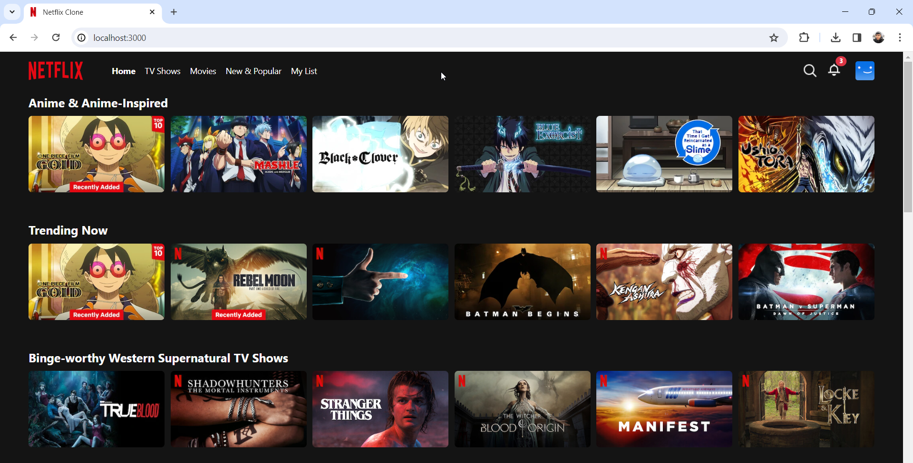

# database
create mysql

user: "admin"

password: "admin"

database: "netflix"

then import netflix.sql

# backend
cd backend

npm install

node app.js

# frontend
cd frontend

npm install

npm run dev

http://localhost:3000/

# manage data
http://localhost:3000/manage/
